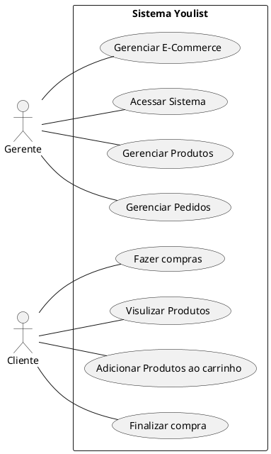
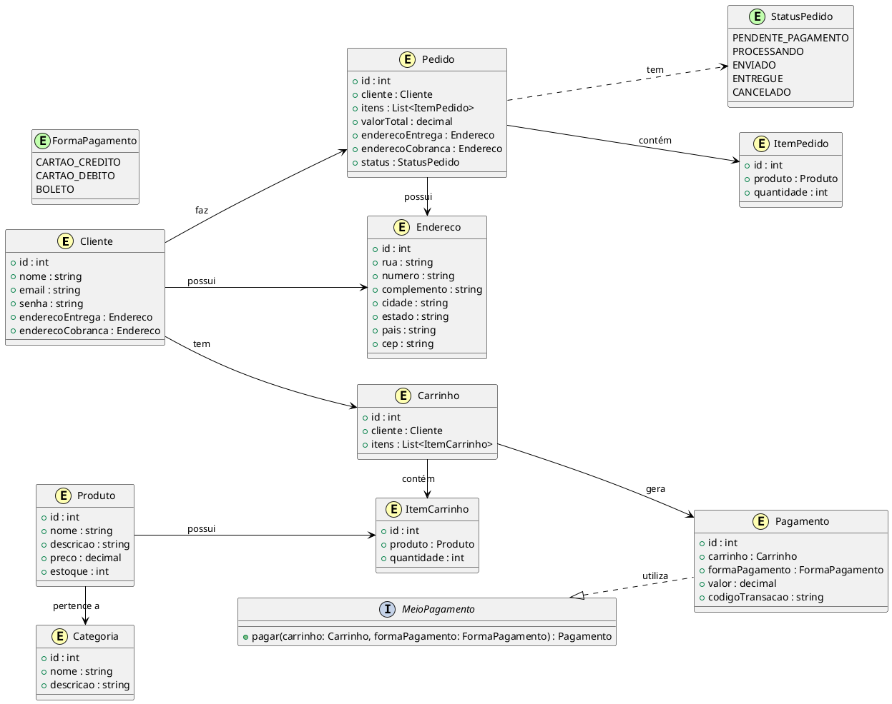
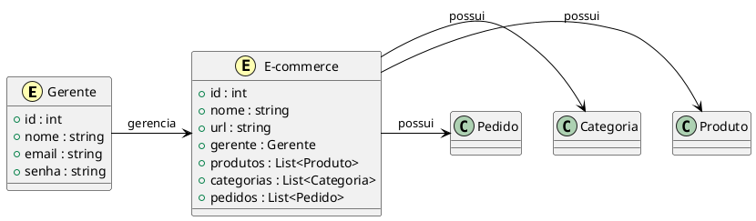
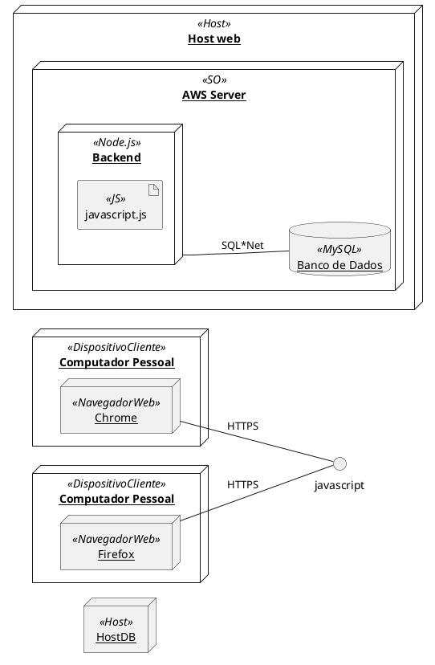

<h2><a href= "https://www.mackenzie.br">Universidade Presbiteriana Mackenzie</a></h2>
<h3><a href= "https://www.mackenzie.br/graduacao/sao-paulo-higienopolis/sistemas-de-informacao">Sistemas de Informação</a></h3>

E-Commerce YouList

**Conteúdo**

- [Autores](#autores)
- [Descrição do projeto](#descrição-do-projeto)
- [Diagrama de casos de uso](#diagrama-de-casos-de-uso)
- [Descrição dos casos de uso](#descrição-dos-casos-de-uso)
- [Protótipos de tela](#protótipos-de-tela)
- [Modelo de domínio](#modelo-de-domínio)
- [Decisões de arquitetura](#decisões-de-arquitetura)
- [Diagrama de implantação](#diagrama-de-implantação)
- [Referências](#referências)

# Autores

* Cristian Leite da Silva
* Aluno 2
* Aluno 3
* Aluno 4

# Descrição do projeto

Este documento tem como objetivo apresentar os requisitos para o desenvolvimento de um sistema de ecommerce de aparelhos eletrônicos. O sistema será desenvolvido utilizando as tecnologias HTML, CSS e JavaScript e será destinado para usuários finais que desejam comprar aparelhos eletrônicos online.

O ecommerce permitirá que os usuários naveguem pelos produtos disponíveis, adicionem produtos a um carrinho de compras, visualizem informações sobre cada produto e concluam o processo de compra online. Além disso, o sistema permitirá que os gerentes de negócios gerenciem o site de ecommerce, realizem análises de desempenho e tomem decisões informadas sobre as operações de negócios.

# Diagrama de casos de uso

# Descrição dos casos de uso

##1.Descrições de casos de uso
###Realizar Compra
**Resumo:** Este caso de uso permite que o usuário navegue pelo catálogo de produtos, selecione os produtos desejados e faça o pagamento.

**Ator Principal:** Cliente

**Pré-Condições:**
• cliente deve estar autenticado no Sistema.

**Fluxo Básico:**
1. cliente navega pelo catálogo de produtos e seleciona os produtos desejados.
2. cliente adiciona os produtos ao carrinho de compras.
3. cliente seleciona o método de pagamento.
4. sistema redireciona o cliente para a página do provedor de serviços de pagamento.
5. cliente fornece as informações de pagamento.
6. provedor de serviços de pagamento processa o pagamento.
7. sistema confirma o pagamento e atualiza o status da compra.
8. sistema envia um e-mail de confirmação da compra para o cliente.
9. sistema remove os produtos do carrinho de compras.

**Fluxo Alternativo:**
• No passo 4, se ocorrer algum erro ao redirecionar o cliente para a página do provedor de serviços de pagamento, o sistema exibe uma mensagem de erro.

###Cadastrar Produto
Este caso de uso permite que um gerente de negócios cadastre um novo produto no sistema.
Ator Principal: Gerente de Negócios

**Pré-condições:**
• O gerente de negócios deve estar autenticado no sistema com permissões de cadastro de produtos.

**Fluxo Básico:**
1. O gerente de negócios acessa a página de cadastro de produtos.
2. O gerente de negócios informa as informações do produto (nome, descrição, preço, imagens, etc.).
3. O sistema valida as informações do produto.

**Fluxo Alternativo:**
• No passo 3, se alguma informação do produto estiver incorreta, o sistema exibe uma mensagem de erro.

# Protótipos de tela

*&lt;Protótipos de tela&gt;*

# Modelo de domínio
**Cliente**

**Gerente**

# Decisões de arquitetura

Utilização de uma arquitetura baseada em microsserviços.

Justificativa: Com o objetivo de garantir a escalabilidade e a manutenção do sistema a longo prazo, optou-se por uma arquitetura baseada em microsserviços. Isso permitirá que cada funcionalidade do sistema seja desenvolvida, implantada e mantida independentemente, facilitando a evolução e atualização do sistema.

Com essa arquitetura, cada microsserviço pode ser desenvolvido em uma linguagem de programação diferente, permitindo escolher a melhor tecnologia para cada funcionalidade do sistema. Além disso, a arquitetura baseada em microsserviços possibilita o uso de ferramentas de orquestração e gerenciamento de contêineres, como o Kubernetes, que facilitam o escalonamento automático dos serviços em resposta ao aumento de tráfego.

Por fim, a arquitetura baseada em microsserviços também oferece uma maior resiliência e disponibilidade do sistema. Caso ocorra uma falha em um dos microsserviços, o restante do sistema não é afetado, mantendo a continuidade da operação.

# Diagrama de implantação

# Referências

*&lt;Lista de referências&gt;*