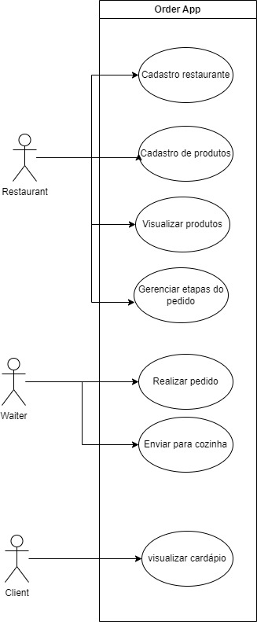
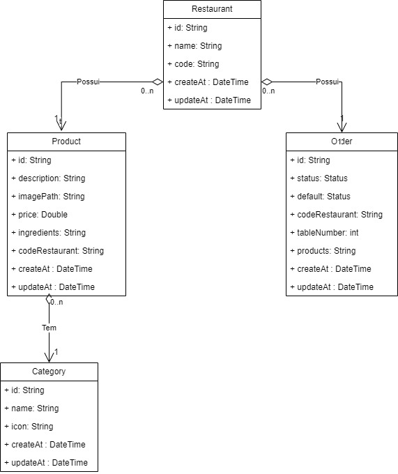

<h2><a href= "https://www.mackenzie.br">Universidade Presbiteriana Mackenzie</a></h2>
<h3><a href= "https://www.mackenzie.br/graduacao/sao-paulo-higienopolis/sistemas-de-informacao">Análise e Desenvolvimento de Sistemas</a></h3>

Order App

**Conteúdo**

- [Autores](#autores)
- [Descrição do projeto](#descrição-do-projeto)
- [Diagrama de casos de uso](#diagrama-de-casos-de-uso)
- [Descrição dos casos de uso](#descrição-dos-casos-de-uso)
- [Protótipos de tela](#protótipos-de-tela)
- [Modelo de domínio](#modelo-de-domínio)
- [Decisões de arquitetura](#decisões-de-arquitetura)
- [Diagrama de implantação](#diagrama-de-implantação)
- [Referências](#referências)

# Autores

* Aluno 1
* Aluno 2
* Aluno 3
* Aluno 4
* Aluno 5
* Aluno 6
* Aluno 7
* Aluno 8

# Descrição do projeto

Sistema de controle de pedidos. O aplicativo mobile permite adicionar pedidos ao carrinho, atualizar, remover e visualizar a descrição dos produtos. Enquanto o sistema web recebe quais pedidos estão na fila de preparo, quais estão em andamento e quais foram finalizados.

# Diagrama de casos de uso

# Descrição dos casos de uso

O restaurante (restaurant) é responsável por se registrar no aplicativo mobile. Após finalizar o cadastro, ele poderá adicionar os produtos que oferece por categoria, como hamburguers, refrigerante, entre outros. Com isso, o garçom (waiter) será responsável por fazer login com o código único, gerado ao finalizar o cadastro restaurante, para atender as mesas, adicionar os pedidos das mesas no carrinho e enviar o pedido para a cozinha. No sistema web é onde acontece o gerenciamento dos pedidos, onde cada pedido enviado pelos garçons entram na fila de espera e podem ser manuseados até concluí-lo.*

# Protótipos de tela

*&lt;Protótipos de tela&gt;*

# Modelo de domínio

;

# Decisões de arquitetura

*&lt;Decisões de arquitetura&gt;*

# Diagrama de implantação

*&lt;Diagrama de implantação&gt;*

# Referências

*&lt;Lista de referências&gt;*