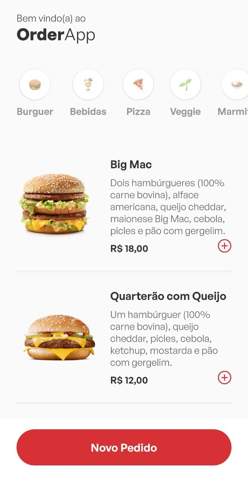
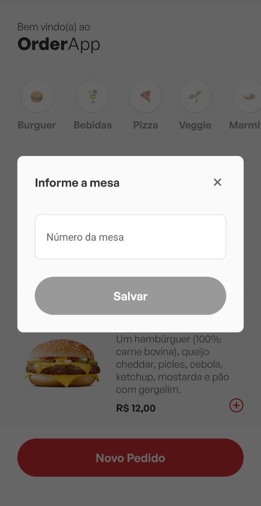
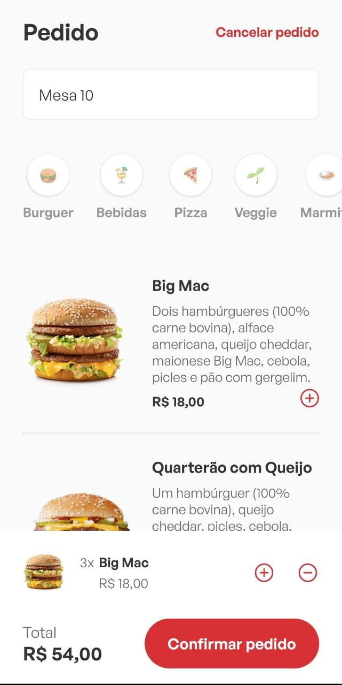
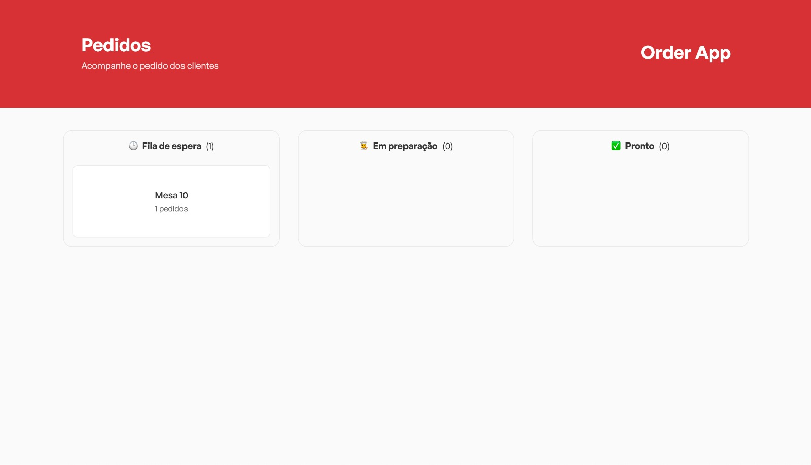
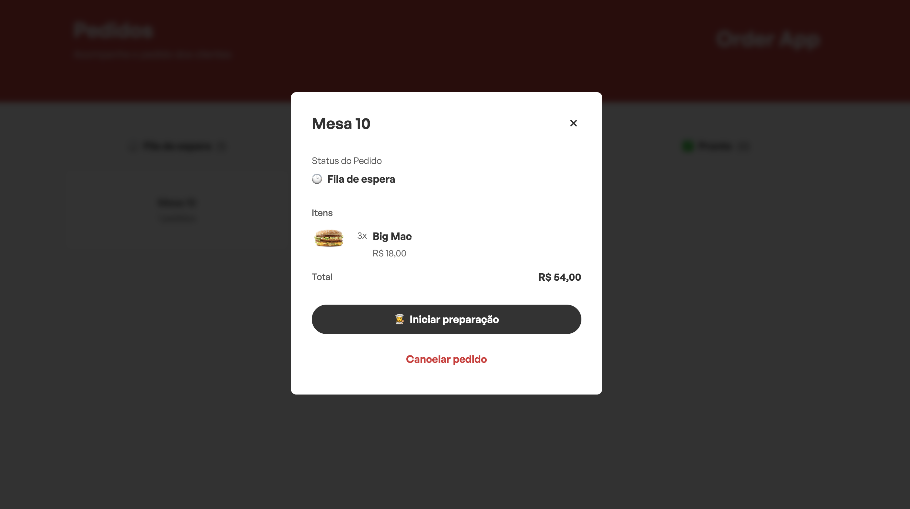
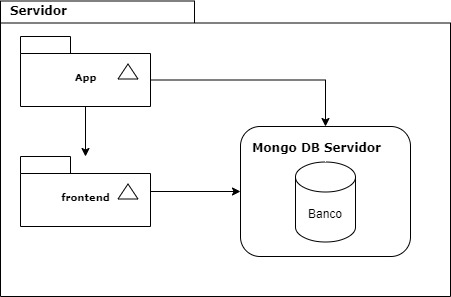

<h2><a href= "https://www.mackenzie.br">Universidade Presbiteriana Mackenzie</a></h2>
<h3><a href= "https://www.mackenzie.br/graduacao/sao-paulo-higienopolis/sistemas-de-informacao">Análise e Desenvolvimento de Sistemas</a></h3>

Order App

**Conteúdo**

- [Autores](#autores)
- [Descrição do projeto](#descrição-do-projeto)
- [Diagrama de casos de uso](#diagrama-de-casos-de-uso)
- [Descrição dos casos de uso](#descrição-dos-casos-de-uso)
- [Protótipos de tela](#protótipos-de-tela)
- [Modelo de domínio](#modelo-de-domínio)
- [Diagrama de implantação](#diagrama-de-implantação)

# Autores

* Davi Monteiro de Oliveira
* Felipe Simão da Silva
* Letícia Caroline da Silva
* Livia Helen da Silva

# Descrição do projeto

O Order App é um sistema de gerenciamento de pedidos. O aplicativo mobile permite cadastrar, editar e excluir categorias e produtos. Além disso, o waiter (garçom) pode adicionar ao carrinho os pedidos realizados por uma mesa em específico. O sistema web recebe quais pedidos foram enviados para a fila de espera da cozinha, quais pedidos estão em andamento e quais foram finalizados, sendo possível remover ao finalizá-lo ou cancelá-lo.

# Diagrama de casos de uso

O diagrama de caso de uso é utilizado para representar os diferentes casos de uso de um sistema, ou seja, as diferentes formas como um usuário pode interagir com o software. Para o Order App definiu-se o seguinte cenário: 

# Descrição dos casos de uso

## Cadastrar produtos vinculando à uma categoria (CDU001)
*Resumo*: O restaurante deve conseguir cadastrar um ou mais produtos vinculando-os à uma categoria.
Ator principal: Restaurante/Waiter

##  O waiter deve conseguir visualizar os produtos cadastrados no sistema (CDU002)
*Resumo*: Os produtos cadastrados devem estar visíveis no app mobile para completar um pedido, junto com a descrição detalhada de cada um ao selecioná-lo.
Ator principal: Restaurante/Waiter

## O waiter deve conseguir finalizar um pedido (CDU003)
*Resumo*: Após selecionar os produtos e indicar a mesa, o waiter deve conseguir finalizar o pedido e enviá-lo para a cozinha (sistema web).
Ator principal: Restaurante/Waiter

## Após finalizar o pedido, o mesmo aparecer no sistema web indicando o número da mesa (CDU004)
*Resumo*: Após finalizar um pedido e enviá-lo para produção, ele deve aparecer no sistema web na fila de produção.
Ator principal: Restaurante/Waiter

## Deve ser possível movimentar o pedido entre as colunas de "Em preparação" e "Pronto" (CDU005)
*Resumo*: Deve ser possível movimentar o pedido entre as colunas, alterando seu status e notificando o usuário.

## Deve ser possível cancelar um pedido (CDU006)
*Resumo*: Para cancelar um pedido, basta selecionar a mesa desejada e selecionar o botão de cancelar. Essa ação só funciona caso o pedido não esteja pronto, ou seja, na coluna de "Fila de espera" e "Em preparação".

## Deve ser possível excluir um pedido após ele ser finalizado (CDU007)
*Resumo*: Para excluir um pedido é necessário que ele seja movimentado para a coluna de "Pronto".
## Visualizar os detalhes do pedido (CDU008)
*Resumo*: Para visualizar os detalhes do pedido, você precisa selecionar uma mesa para abrir um modal indicando quais foram os produtos que aquela mesa solicitou, além disso, é possível ver o valor final que deverá ser pago.

### *Observação*: Algumas funcionalidades não foram implementadas para redução de escopo para cumprir prazos como cadastro de restaurante e geração do QR Code para visualizar o cardápio.

# Protótipos de tela
## Mobile

Home

Selecionando a mesa

Pedido

Enviado para a cozinha

## WEB

Gerenciamento de pedidos 

Detalhes do pedido

# Modelo de domínio

Diagrama de domínio é uma ferramenta utilizada na análise de requisitos de software para representar graficamente as principais entidades (classes) envolvidas em um determinado domínio ou contexto.

# Diagrama de implantação

 