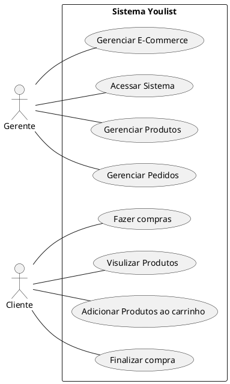
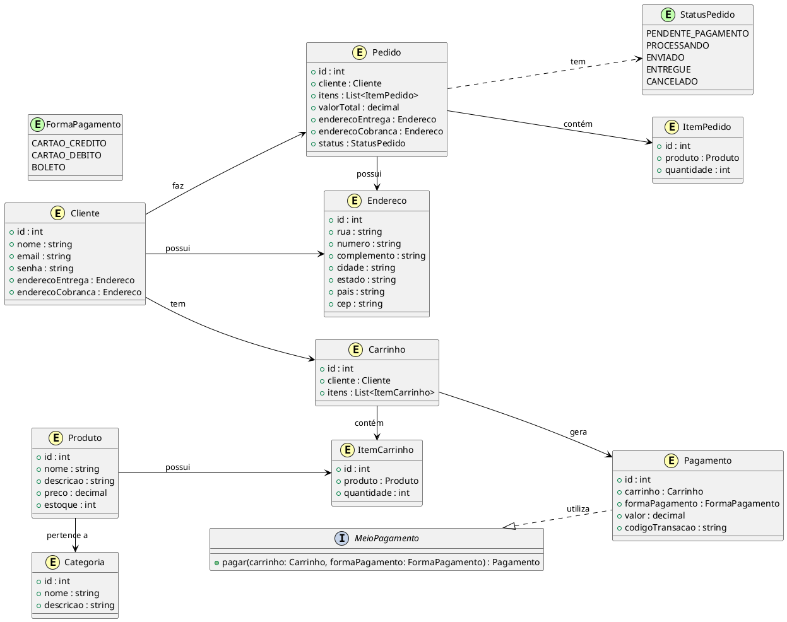
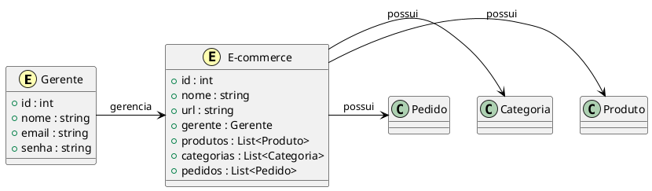
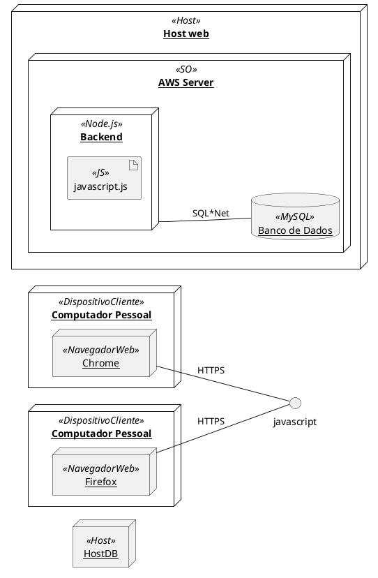

<h2><a href= "https://www.mackenzie.br">Universidade Presbiteriana Mackenzie</a></h2>
<h3><a href= "https://www.mackenzie.br/graduacao/sao-paulo-higienopolis/sistemas-de-informacao">Sistemas de Informação</a></h3>

<font size="+12"><center>
E-Commerce YouList
</center></font>


**Conteúdo**

- [Autores](#autores)
- [Descrição do projeto](#descrição-do-projeto)
- [Diagrama de casos de uso](#diagrama-de-casos-de-uso)
- [Descrição dos casos de uso](#descrição-dos-casos-de-uso)
- [Protótipos de tela](#protótipos-de-tela)
- [Modelo de domínio](#modelo-de-domínio)
- [Decisões de arquitetura](#decisões-de-arquitetura)
- [Diagrama de implantação](#diagrama-de-implantação)
- [Referências](#referências)


# Autores

* Cristian Leite da Silva
* Marcos Paulo Santos de Oliveira
* Bruna Ariane Felix da Silva
* Aluno 4


# Descrição do projeto

Este documento tem como objetivo apresentar os requisitos para o desenvolvimento de um sistema de ecommerce de aparelhos eletrônicos. O sistema será desenvolvido utilizando as tecnologias HTML, CSS e JavaScript e será destinado para usuários finais que desejam comprar aparelhos eletrônicos online.

O ecommerce permitirá que os usuários naveguem pelos produtos disponíveis, adicionem produtos a um carrinho de compras, visualizem informações sobre cada produto e concluam o processo de compra online. Além disso, o sistema permitirá que os gerentes de negócios gerenciem o site de ecommerce, realizem análises de desempenho e tomem decisões informadas sobre as operações de negócios.

# Diagrama de casos de uso



# Descrição dos casos de uso

##1.Descrições de casos de uso
###Realizar Compra
**Resumo:** Este caso de uso permite que o usuário navegue pelo catálogo de produtos, selecione os produtos desejados e faça o pagamento.

**Ator Principal:** Cliente

**Pré-Condições:**
• cliente deve estar autenticado no Sistema.

**Fluxo Básico:**
1. cliente navega pelo catálogo de produtos e seleciona os produtos desejados.
2. cliente adiciona os produtos ao carrinho de compras.
3. cliente seleciona o método de pagamento.
4. sistema redireciona o cliente para a página do provedor de serviços de pagamento.
5. cliente fornece as informações de pagamento.
6. provedor de serviços de pagamento processa o pagamento.
7. sistema confirma o pagamento e atualiza o status da compra.
8. sistema envia um e-mail de confirmação da compra para o cliente.
9. sistema remove os produtos do carrinho de compras.

**Fluxo Alternativo:**
• No passo 4, se ocorrer algum erro ao redirecionar o cliente para a página do provedor de serviços de pagamento, o sistema exibe uma mensagem de erro.


###Cadastrar Produto
Este caso de uso permite que um gerente de negócios cadastre um novo produto no sistema.
Ator Principal: Gerente de Negócios

**Pré-condições:**
• O gerente de negócios deve estar autenticado no sistema com permissões de cadastro de produtos.

**Fluxo Básico:**
1. O gerente de negócios acessa a página de cadastro de produtos.
2. O gerente de negócios informa as informações do produto (nome, descrição, preço, imagens, etc.).
3. O sistema valida as informações do produto.

**Fluxo Alternativo:**
• No passo 3, se alguma informação do produto estiver incorreta, o sistema exibe uma mensagem de erro.

# Protótipos de tela

*&lt;Protótipos de tela&gt;*

# Modelo de domínio
**Cliente**

**Gerente**

# Decisões de arquitetura

Utilização de uma arquitetura baseada em microsserviços.

Justificativa: Com o objetivo de garantir a escalabilidade e a manutenção do sistema a longo prazo, optou-se por uma arquitetura baseada em microsserviços. Isso permitirá que cada funcionalidade do sistema seja desenvolvida, implantada e mantida independentemente, facilitando a evolução e atualização do sistema.

Com essa arquitetura, cada microsserviço pode ser desenvolvido em uma linguagem de programação diferente, permitindo escolher a melhor tecnologia para cada funcionalidade do sistema. Além disso, a arquitetura baseada em microsserviços possibilita o uso de ferramentas de orquestração e gerenciamento de contêineres, como o Kubernetes, que facilitam o escalonamento automático dos serviços em resposta ao aumento de tráfego.

Por fim, a arquitetura baseada em microsserviços também oferece uma maior resiliência e disponibilidade do sistema. Caso ocorra uma falha em um dos microsserviços, o restante do sistema não é afetado, mantendo a continuidade da operação.

# Diagrama de implantação


# Plano de testes de cenários

## Plano de Testes para o Diagrama Cadastrar Produto

**Identificação única: 
CP-001 Página de cadastro

Caso de uso em que se baseia:
Cadastrar Produto

Cenário: 
O gerente de negócios acessa a página de cadastro de produtos e preenche os campos necessários para cadastrar um novo produto.

Preparação:
•	Acesso ao sistema como gerente de negócios;
•	Página de cadastro de produtos acessível e funcionando corretamente.

Passos para a execução do teste:
1. Acessar a página de cadastro de produtos;
2. Preencher o formulário com informações válidas para um novo produto, incluindo nome, descrição, categoria, preço e quantidade em estoque;
3. Clicar no botão "Cadastrar";
4. Verificar se o produto foi cadastrado com sucesso;
5. Verificar se o novo produto aparece na lista de produtos cadastrados;
6. Verificar se as informações do novo produto estão corretas e completas.

Resultado esperado:
•	O produto deve ser cadastrado com sucesso;
•	O novo produto deve aparecer na lista de produtos cadastrados;
•	As informações do novo produto devem estar corretas e completas.

Resultado do teste: 
Sucesso

Descrição do resultado obtido:
O produto foi cadastrado com sucesso, apareceu na lista de produtos cadastrados e as informações do novo produto estavam corretas e completas.

Data da última execução do teste: 05/04/2023
 
**Identificação única: 
CP-002 Informações de produtos

Caso de uso em que se baseia: 
Cadastrar Produto

Cenário: 
Cadastrar um novo produto com informações inválidas e verificar se o sistema apresenta uma mensagem de erro.

Preparação: 
O sistema deve estar funcionando corretamente e não deve haver produtos cadastrados.

Passos para a execução do teste:
1. Acessar a página de cadastro de produtos.
2. Preencher o formulário com as seguintes informações:
•	Nome do produto: ""
•	Descrição: "Descrição do produto de teste"
•	Preço: R$ -10,00
•	Quantidade em estoque: -1
3. Clicar no botão "Cadastrar".
4. Verificar se o sistema apresenta uma mensagem de erro informando que os campos estão inválidos.

Resultado esperado: 
CO sistema deve apresentar uma mensagem de erro informando que os campos estão inválidos.

Resultado do teste:
Sucesso

Descrição do resultado obtido: 
O sistema apresentou corretamente uma mensagem de erro informando que os campos estão inválidos.

Data da última execução do teste: 05/04/2023

**Identificação única:
CP-004 Funcionamento do catálogo

Caso de uso em que se baseia:
Cadastrar Produto

Cenário:
Verificar se o sistema está funcionando corretamente e se a página de cadastro está disponível para acesso do Gerente de Negócios

Preparação:
•	O Gerente de Negócios acessa a página de cadastro de produto
•	O Gerente de Negócios preenche as informações do produto nos campos correspondentes
•	O Gerente de Negócios clica no botão "Cadastrar"

Passos para a execução do teste:
1. Acesse a página de cadastro de produto
2. Preencha todos os campos obrigatórios com as informações do produto
3. Clique no botão "Cadastrar"

Resultado esperado:
O produto é cadastrado com sucesso no sistema e as informações são salvas corretamente

Resultado do teste: 
Sucesso

Descrição do resultado obtido:
O produto foi cadastrado com sucesso no sistema e as informações foram salvas corretamente

Data da última execução do teste: 10/04/2023

**Identificação única:
CP-005 Validação do produto

Caso de uso em que se baseia: 
Cadastrar Produto

Cenário:
Validação dos produtos cadastrados pelo gerente de negócios

Preparação:
•	Acesso ao sistema com perfil de gerente de negócios
•	Banco de dados com produtos previamente cadastrados

Passos para a execução do teste:
1. Acessar a tela de cadastro de produtos
2. Preencher os campos com informações válidas para um novo produto
3. Clicar no botão "Salvar"
4. Verificar se o produto foi salvo com sucesso no banco de dados
5. Validar se as informações cadastradas estão corretas e completas
6. Tentar cadastrar um novo produto com informações faltantes ou inválidas
7. Verificar se o sistema exibe mensagens de erro indicando os campos que precisam ser corrigidos
8. Corrigir as informações inválidas e tentar salvar novamente
9. Verificar se o produto é salvo com sucesso no banco de dados

Resultado esperado:
•	Produto cadastrado com sucesso no banco de dados, com as informações corretas e completas
•	Mensagens de erro exibidas quando campos obrigatórios ou inválidos são identificados
•	Produto não é salvo quando informações inválidas ou faltantes estão presentes

Resultado do teste:
Sucesso

Descrição do resultado obtido:
O teste foi bem-sucedido. O produto foi cadastrado com sucesso no banco de dados com as informações corretas e completas. Mensagens de erro foram exibidas quando campos obrigatórios ou inválidos foram identificados e o sistema não permitiu o salvamento do produto quando informações inválidas ou faltantes estavam presentes.

Data da última execução do teste: 10/04/2023

## Plano de Testes para o Diagrama Realizar Compra

**Identificação única:
RC-001 Navegação no catálogo dos produto

Caso de uso em que se baseia:
Navegar pelo catálogo de produtos

Cenário:
 O usuário acessa o sistema de e-commerce e deseja navegar pelo catálogo de produtos disponíveis.
 
Preparação:
O sistema deve estar em pleno funcionamento e o catálogo de produtos deve estar preenchido com, no mínimo, três produtos cadastrados.
Passos para a execução do teste:
1. O usuário acessa o sistema de e-commerce;
2. O usuário clica no menu "Produtos";
3. O usuário visualiza a lista de produtos disponíveis no catálogo.
4. O usuário seleciona um produto da lista;
5. O usuário visualiza os detalhes do produto selecionado.

Resultado esperado:
O usuário consegue visualizar a lista de produtos disponíveis no catálogo.

Resultado do teste: 
Sucesso

Descrição do resultado obtido:
O usuário conseguiu visualizar a lista de produtos disponíveis no catálogo.

Data da última execução do teste: 17/04/2023
 
 
**Identificação única:
RC-002 Adicionar produtos

Caso de uso em que se baseia:
Realizar Compra

Cenário:
Adicionar produtos ao carrinho de compras

Preparação:
•	O sistema deve estar funcionando corretamente
•	O usuário deve estar logado em uma conta válida
•	A página de produtos deve estar acessível

Passos para a execução do teste: 
1.	Acessar a página de produtos
2.	Selecionar um produto para adicionar ao carrinho de compras
3.	Clicar no botão "Adicionar ao Carrinho"
4.	Verificar se o produto foi adicionado corretamente ao carrinho de compras
5.	Repetir os passos 2 a 4 para adicionar mais produtos

Resultado esperado: 
•	O produto selecionado deve ser adicionado corretamente ao carrinho de compras
•	O carrinho de compras deve ser atualizado com a quantidade de produtos adicionados
•	O usuário deve ser capaz de adicionar mais de um produto ao carrinho

Resultado do teste: Sucesso

Descrição do resultado obtido:
O produto foi adicionado corretamente ao carrinho de compras. O carrinho de compras foi atualizado com a quantidade de produtos adicionados e o usuário foi capaz de adicionar mais de um produto ao carrinho.

Data da última execução do teste: 24/04/2023


**Identificação única: 
RC-003 Método de pagamento

Caso de uso em que se baseia: 
Realizar Compra

Cenário: 
Adicionar itens ao carrinho e selecionar forma de pagamento

Preparação:
•	O usuário está logado na conta de cliente
•	O catálogo de produtos possui itens disponíveis para compra
•	O carrinho de compras está vazio

Passos para a execução do teste:
1.	Navegar pelo catálogo de produtos e adicionar um ou mais itens ao carrinho
2.	Ir para a página do carrinho de compras
3.	Selecionar uma forma de pagamento disponível, sendo elas: cartão de crédito, boleto bancário e transferência bancária
4.	Preencher as informações necessárias para a forma de pagamento selecionada
5.	Confirmar a compra

Resultado esperado:
•	Cartão de crédito: A compra é aprovada e o usuário é redirecionado para a página de confirmação de compra
•	Boleto bancário: O boleto é gerado e exibido ao usuário, que deve realizar o pagamento em um prazo determinado. Após a confirmação do pagamento, a compra é aprovada e o usuário é redirecionado para a página de confirmação de compra
•	Transferência bancária: As informações bancárias são exibidas ao usuário, que deve realizar a transferência em um prazo determinado. Após a confirmação da transferência, a compra é aprovada e o usuário é redirecionado para a página de confirmação de compra
Resultado do teste:
•	Cartão de crédito: A compra é aprovada e o usuário é redirecionado para a página de confirmação de compra
•	Boleto bancário: O boleto é gerado corretamente e as informações de pagamento são exibidas ao usuário. Após a confirmação do pagamento, a compra é aprovada e o usuário é redirecionado para a página de confirmação de compra
•	Transferência bancária: As informações bancárias são exibidas corretamente ao usuário. Após a confirmação da transferência, a compra é aprovada e o usuário é redirecionado para a página de confirmação de compra

Descrição do resultado obtido: Todas as formas de pagamento foram testadas com sucesso

Data da última execução do teste: 27/04/2023

**Identificação única:
RC-004 Página de serviços de pagamento

Caso de uso em que se baseia:
Realizar Compra

Cenário:
Verificar a página de serviços de pagamento durante o processo de compra

Preparação:
A página de serviços de pagamento está disponível e integrada ao sistema de compra.

Passos para a execução do teste:
1.	Acessar a página de compra e adicionar produtos ao carrinho;
2.	Selecionar a opção de finalizar compra;
3.	Selecionar a opção de pagamento;
4.	Verificar se a página de serviços de pagamento foi carregada corretamente;
5.	Verificar se todas as opções de pagamento estão disponíveis;
6.	Selecionar uma opção de pagamento e preencher as informações necessárias;
7.	Verificar se as informações de pagamento foram validadas corretamente;
8.	Concluir o processo de pagamento.

Resultado esperado:
•	A página de serviços de pagamento deve ser carregada corretamente;
•	Todas as opções de pagamento devem estar disponíveis;
•	As informações de pagamento devem ser validadas corretamente;
•	O processo de pagamento deve ser concluído com sucesso.

Resultado do teste:
Sucesso

Descrição do resultado obtido:
A página de serviços de pagamento foi carregada corretamente;
Todas as opções de pagamento estão disponíveis;
As informações de pagamento foram validadas corretamente;
O processo de pagamento foi concluído com sucesso.

Data da última execução do teste: 01/05/2023


**Identificação única:
RC-005 Informações de pagamento

Caso de uso em que se baseia:
Realizar Compra

Cenário:
O usuário selecionou os produtos que deseja comprar e adicionou ao carrinho;
O usuário selecionou a opção de pagamento e está na tela de informações de pagamento.

Preparação:
O carrinho de compras possui pelo menos um produto adicionado.
Passos para a execução do teste:
1.	Preencher o campo "Nome do titular do cartão" com um nome válido;
2.	Preencher o campo "Número do cartão" com um número de cartão válido;
3.	Selecionar uma opção de bandeira de cartão válida;
4.	Selecionar um mês e um ano válidos para a data de validade do cartão;
5.	Preencher o campo "Código de segurança" com um código válido;
6.	Clicar no botão "Finalizar compra".

Resultado esperado:
A compra é processada com sucesso e o usuário é redirecionado para uma tela de confirmação de compra.

Resultado do teste: 
Sucesso

Descrição do resultado obtido: 
A compra foi processada com sucesso e o usuário foi redirecionado para uma tela de confirmação de compra.

Data da última execução do teste: 02/05/2023.

**Identificação única:
RC-006 Confirmação de pagamento

Caso de uso em que se baseia:
Realizar Compra

Cenário:
Confirmação de pagamento para concluir a compra

Preparação:
•	O usuário já adicionou produtos ao carrinho de compras
•	O usuário já preencheu as informações de pagamento

Passos para a execução do teste:
1.	O usuário clica no botão "Confirmar Pagamento"
2.	O sistema exibe uma mensagem de confirmação de pagamento
3.	O usuário verifica se todas as informações de pagamento estão corretas na tela de confirmação
4.	O usuário clica no botão "Confirmar" para finalizar a compra

Resultado esperado:
•	O sistema deve exibir uma mensagem de confirmação de pagamento
•	Todas as informações de pagamento devem ser exibidas corretamente na tela de confirmação
•	A compra deve ser finalizada com sucesso

Resultado do teste:
Sucesso

Descrição do resultado obtido:
O teste foi executado com sucesso e todas as informações foram exibidas corretamente na tela de confirmação. A compra foi finalizada com sucesso.

Data da última execução do teste: 03/05/2023

**Identificação única:
RC-007 Email de confirmação de compra

Caso de uso em que se baseia: 
Realizar Compra

Cenário:
Envio do e-mail de confirmação de compra ao cliente

Preparação:
•	Cliente com informações válidas e confirmadas no sistema.
•	Compra realizada e confirmada com sucesso.
•	Endereço de e-mail do cliente cadastrado no sistema.
Passos para a execução do teste:
1.	Verificar se o sistema tem acesso ao endereço de e-mail do cliente.
2.	Verificar se o e-mail a ser enviado contém as informações corretas sobre a compra realizada, como o nome do cliente, o número do pedido, a descrição dos itens comprados e o valor total.
3.	Verificar se o e-mail é enviado ao endereço de e-mail do cliente.
4.	Verificar se o e-mail é enviado em um formato legível e compreensível.

Resultado esperado:
O sistema deve enviar um e-mail de confirmação de compra ao cliente contendo as informações corretas sobre a compra realizada.

Resultado do teste: Sucesso

Descrição do resultado obtido:
O e-mail de confirmação foi enviado corretamente, com todas as informações sobre a compra realizada, para o endereço de e-mail cadastrado no sistema.

Data da última execução do teste: 04/05/2023.


**Identificação única:
RC-008 Remoção dos produtos do carrinho

Caso de uso em que se baseia:
Realizar Compra

Cenário:
Limpar carrinho após a conclusão da compra

Preparação:
O usuário adicionou alguns itens ao carrinho e finalizou a compra com sucesso.

Passos para a execução do teste:
1.	Acesse a página de carrinho.
2.	Verifique se os itens adicionados anteriormente ainda estão visíveis no carrinho.
3.	Clique no botão "Concluir Compra" e finalize o processo de compra.
4.	Após a conclusão da compra, verifique se o carrinho foi limpo e não há mais nenhum item visível.

Resultado esperado:
O carrinho deve ser limpo após a conclusão da compra, não mostrando mais nenhum item adicionado anteriormente.

Resultado do teste: Sucesso

Descrição do resultado obtido:
O carrinho foi limpo com sucesso após a conclusão da compra.

Data da última execução do teste: 05/05/2023.


```

# Referências

IEEE 830-1998 - IEEE Recommended Practice for Software Requirements Specifications: https://ieeexplore.ieee.org/document/720574

ISO/IEC/IEEE 29148:2018 - Systems and software engineering -- Life cycle processes -- Requirements engineering: https://www.iso.org/standard/72089.html

Template para especificação de requisitos de software (em inglês): https://www.perforce.com/blog/alm/how-write-software-requirements-specification-srs-document#:~:text=A%20software%20requirements%20specification%20(SRS)%20is%20a%20document%20that%20describes,stakeholders%20(business%2C%20users).

Como escrever uma Especificação de Requisitos de Software: https://www.monitoratec.com.br/blog/especificacao-de-requisitos-de-software/
